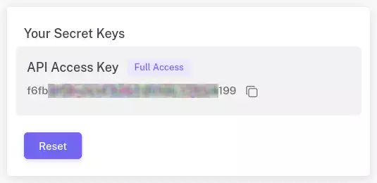

# CaptchaX API

**CaptchaX** delivers rapid and accurate Captcha solving and image recognition through intelligent AI and human-assisted verification. This dependable tool efficiently tackles various image-based challenges, making your online automation smoother and more reliable.

It's not just about bypassing Captchas; CaptchaX empowers your systems with comprehensive visual understanding.

## Getting Started

Learn how to easily use [CaptchaX services](#). Whether you want to **automatically solve Captchas** or connect with our API, the following steps will guide you.

### Step 1: Create Account

Before you start using **CaptchaX**, you need to go to the [Registration](#) page and create your account.

### Step 2: Get Your API Key

Once you have registered, head over to the [Dashboard](#). From here you can obtain your API key.



### Step 3: Make The Request

Now everything is ready, just call the [getToken](/gettoken) API and wait for the result. Here is an example request.

```http 
POST https://api.captchax.ai/getToken HTTP/1.1
Host: api.captchax.ai
Content-Type: application/json
```

```json 
{
    "info": {
        "api_service": "ReCaptchaV2Enterprise",
        "api_token": "YOUR_API_KEY" // Paste API key from Step 2 here
    },
    "params": {
        "websiteURL": "https://www.google.com/recaptcha/api2/demo",
        "websiteKey": "6Le-wvkSAAAAAPBMRTvw0Q4Muexq9bi0DJwx_mJ-"
    }
}
```

If your account has sufficient credits and the request has valid parameters, you will receive the following API response.

```json 
{
    "data": {
        "token": "03AFcWeA7vQiFmaYZWoYWht...",
        "createTime": 1745415127693,
        "endTime": 1745415127693
    },
    "error": false,
    "message": "Success"
}
```

We support various types of Captchas. You can use the `info > api_service` parameter to specify the Captcha type.

-   [reCAPTCHA V3](/captcha-types/recaptcha-v3)
-   [reCAPTCHA V2](/captcha-types/recaptcha-v2)
-   [reCAPTCHA V3 Enterprise](/captcha-types/recaptcha-v3-enterprise)
-   [reCAPTCHA V2 Enterprise](/captcha-types/recaptcha-v2-enterprise)
-   [reCAPTCHA Mobile](/captcha-types/recaptcha-mobile)
-   [AWS WAF](/captcha-types/aws-waf)
-   [MTCaptcha](/captcha-types/mtcaptcha)
-   [Cloudflare Turnstile](/captcha-types/cloudflare-turnstile)
